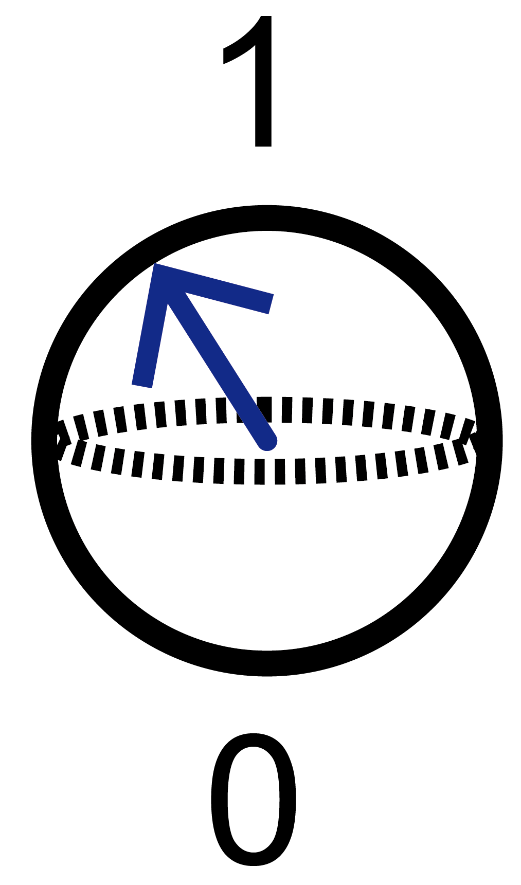

<!-- Improved compatibility of back to top link: See: https://github.com/othneildrew/Best-README-Template/pull/73 -->
<a id="readme-top"></a>
<!--
*** Thanks for checking out the Best-README-Template. If you have a suggestion
*** that would make this better, please fork the repo and create a pull request
*** or simply open an issue with the tag "enhancement".
*** Don't forget to give the project a star!
*** Thanks again! Now go create something AMAZING! :D
-->


<!-- PROJECT SHIELDS -->
<!--
*** I'm using markdown "reference style" links for readability.
*** Reference links are enclosed in brackets [ ] instead of parentheses ( ).
*** See the bottom of this document for the declaration of the reference variables
*** for contributors-url, forks-url, etc. This is an optional, concise syntax you may use.
*** https://www.markdownguide.org/basic-syntax/#reference-style-links
-->
[<!-- PROJECT LOGO -->
<br />

<div align="left">
  <a href="https://github.com/shinyoung3/QC-MTV">
    
  </a>


<h3 align="center">Quantum Computing Based Design of Multivariate Porous Materials</h3>


<!-- TABLE OF CONTENTS -->

<details>
  <summary>Table of Contents</summary>
  <ol>
    <li>
      <a href="#about-the-project">About The Project</a>
    </li>
    <li>
        <a href="#prerequisites">Prerequisites</a></li>
      </ul>
    </li>
    <li><a href="#contributing">Contributing</a></li>
    <li><a href="#license">License</a></li>
    <li><a href="#contact">Contact</a></li>
  </ol>
</details>


<!-- ABOUT THE PROJECT -->

## About The Project

\Desktop\QuantumPPT\Figure1.png)

This work presents a novel quantum computing algorithm designed to efficiently explore the vast potential space of Multivariate(MTV) porous materials. We utilized qubits to represent the reticular architecture of these materials and incorporated compositional, structural, and balance constraints into the Hamiltonian. This approach identifies optimal arrangements of building blocks that meet all specified design criteria. You can follow the instructions provided to construct your own MTV porous materials.

<p align="right">(<a href="#readme-top">back to top</a>)</p>

<!-- GETTING STARTED -->

### Prerequisites

This is an example of how to list things you need to use the software and how to install them.

**Installation**

1. Get a free API Key at [https://example.com](https://example.com)

2. Clone the repo

   ```sh
   git clone https://github.com/github_username/repo_name.git
   ```

3. Install NPM packages

   ```sh
   npm install
   ```

4. Enter your API in `config.js`

   ```js
   const API_KEY = 'ENTER YOUR API';
   ```

5. Change git remote url to avoid accidental pushes to base project

   ```sh
   git remote set-url origin github_username/repo_name
   git remote -v # confirm the changes
   ```

<p align="right">(<a href="#readme-top">back to top</a>)</p>

<!-- CONTRIBUTING -->

## Contributing

Contributions are welcome! If you have any suggestions or find any issues, please open an issue or a pull request.
Don't forget to give the project a star! Thanks again!

1. Fork the Project
2. Create your Feature Branch (`git checkout -b feature/AmazingFeature`)
3. Commit your Changes (`git commit -m 'Add some AmazingFeature'`)
4. Push to the Branch (`git push origin feature/AmazingFeature`)
5. Open a Pull Request

<p align="right">(<a href="#readme-top">back to top</a>)</p>

<!-- LICENSE -->

## License

Distributed under the project_license. See `LICENSE.txt` for more information.

<p align="right">(<a href="#readme-top">back to top</a>)</p>

<!-- CONTACT -->

## Contact

Your Name  

Project Link: [https://github.com/shinyoung3/QC-MTV

<p align="right">(<a href="#readme-top">back to top</a>)</p>

[]: 
